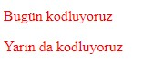
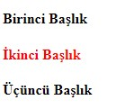
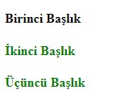
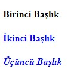
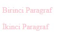
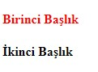

# CSS

### CSS(Cascading Style Sheets) Nedir?

CSS (Basamaklanmış Stil Katmanları), web sayfasını şekillendirmek için kullanılan bir kodlama türüdür. CSS kullanarak web sayfasının görünümünü ve düzenini değiştirebiliriz. Bir web sitesinin görünümünün masaüstü bilgisayarlar, tabletler ve mobil cihazlar gibi farklı ekranlarda nasıl değiştiğini de tanımlayabiliriz. CSS, C++ veya JavaScript gibi bir programlama dili **değildir**. Bunun nedeni, CSS'in amacının web tarayıcıları için biçimlendirmeye(HTML'e) stil vermek olmasıdır. HTML yalnızca içeriği "işaretleyen" bir dildir - yani, belgeye belirli bir görsel ve yapısal biçimlendirme verir.

### CSS Syntax

Örneğin, h1 etiketinin rengini değiştirmek istiyorum.

```HTML
<h1>I'm a Header</h1>
```

CSS'de bir selector, HTML öğelerini etiket adı, sınıf adı, kimliği ve çok daha fazlasına göre bulmak için kullanılır.

HTML öğesi için bir selector tanımlayalım ve ardından selector parantezleri arasında her biri noktalı virgülle biten CSS kurallarını bildirelim.


```CSS
h1 { color: red;  }
```

CSS kodlarımızı .css uzantılı bir dosya içerisinde tutar ve bu dosyayı HTML sayfası içerisine basit bir kodla çağırabiliriz. Örneğin CSS dosyamızın adı "hello.css" olsun ve bu dosyayı Html sayfaya eklemek için HTML içine yazmamız gereken kod şu şekildedir.

```HTML
<head> <link rel=”stylesheet” type=”text/css” href=”hello.css” /> </head>
```

Bir CSS selector tanımlamanın birçok farklı yolu vardır:

```Class Selector:``` HTML öğelerini sınıf özelliklerine göre bulur.

```ID Selector:``` Öğeleri belirli kimliğine göre bulur.

```Element Selector:``` Öğeleri etiket adlarına göre bulur.


## External, Internal ve Inline CSS Kullanımı

CSS, web sitenizin ekranda nasıl görüneceğini belirleyen belirli stil kurallarına sahip dosyalardır. CSS kuralları, web sitenizin HTML dosyalarına çeşitli şekillerde ve yerlerde uygulanabilir. External yani harici bir stil sayfası, Internal yani dahili bir stil sayfası veya Inline yani satır içi stil kullanabilirsiniz. Her yöntemin belirli kullanımlara uygun avantajları vardır.

External stil sayfası, bir web sayfasından bağlanan bağımsız bir .css dosyasıdır. External stil sayfasının avantajı, bir kez oluşturulabilmesi ve birden çok web sayfasına uygulanabilmesidir. Site tasarımınızda geniş çaplı değişiklikler yapmanız gerekirse eğer, stil sayfasında tek bir değişiklik yapabilirsiniz ve bu değişiklik tüm bağlantılı sayfalara uygulanarak zamandan ve emekten tasarruf sağlar.

Internal stil sayfası, HTML dosyasının head bölümünde sayfa için CSS kural kodlarını barındırır. Kural kodları yalnızca o sayfa için geçerlidir, ancak sayfa kodunda birden çok öğeye stil uygulamak için kullanılabilecek class ve id’leri yapılandırabilirsiniz. Yine, CSS kodunda yapılacak tek bir değişiklik, sayfadaki tüm etiketlenmiş öğelere uygulanacaktır.

Inline stili, belirli bir sayfa öğesine stil vermek için, belirli bir HTML etiketi içinde kullanılır. Hızlı ve kalıcı değişiklikler için kullanışlıdırlar, ancak bir tasarım değişikliği yapmaya karar vermeniz durumunda, oluşturduğunuz her Inline stilin ayrı ayrı düzenlenmesi gerektiğinden, External ve Internal stil sayfalarından daha kullanışlı değildir ve diğerlerine göre çok fazla tercih edilmez.

### External CSS Kullanımı

External CSS, normal HTML dosyanızdan bağımsız bir dosyadır ve .css uzantılıdır. CSS dosyanızı oluşturduktan sonra mutlaka HTML dosyanıza linklemeniz gerekir. Yoksa CSS dosyanız işlevsiz kalacak ve HTML sayfanızda yaptığınız değişiklikleri göremeyeceksiniz. Hadi gelin bir de örnek üzerinde görelim.

.css uzantılı dosyamızı oluşturduktan sonra içine kodlarımızı bu şekilde yazıyoruz:

```CSS
body { background-color: #f7cac9; }

.firstDiv, .secondDiv, .thirdDiv { border: 7px outset gold; background-color: lightblue; text-align: center; }
```

Daha sonra HTML sayfamıza geri dönüyoruz ve yazdığımız bu External CSS kodunu head bölümüne aşağıdaki gibi linkliyoruz. İşte bu kadar. 

```HTML
<link rel="stylesheet" href="style.css">
```

### Internal CSS Kullanımı

Internal CSS, stil kodlarının direk HTML dosyasının içinde head bölümünde kullanıldığı bir yöntemdir. head bölümünün içinde bir style etiketi açtıktan sonra içine gerekli CSS kodlarını yazabilirsiniz.

```HTML
<!DOCTYPE html> <html>
<head>
<style>
body {
  background-color: #f7cac9;
}

.firstDiv {
  border: 7px outset gold;
  background-color: lightblue;
  text-align: center;
}
</style>
</head>
<body>
<div class="firstDiv">
  <h2>Lorem ipsum</h2>
  <p>Lorem ipsum dolor sit amet consectetuer</p>
</div>
</body>
</html>
```

### Inline CSS Kullanımı

Inline yani satır içi stiller, doğrudan HTML kodunuzdaki herhangi bir öğeye uygulanır. Stil niteliği ve ardından normal CSS özellikleri bir HTML etiketi içinde belirtilir. Kullanımı aşağıdaki örnekte gösterildiği gibidir:

```HTML
<!DOCTYPE html> <html>
<head>
</head>
<body>
<div style="border-width:7px; border-style:outset; border-color:gold; background-color:lightblue; text-align:center;">
  <h2>Lorem ipsum</h2>
  <p>Lorem ipsum dolor sit amet consectetuer</p>
</div>
</body>
</html>
```


## Açıklama Satırları ile Çalışmak ve Genel Font Özellikleri

### Açıklama Satırları

CSS'de açıklama satırı bu şekilde başlar /* ve bu şekilde biter */

```CSS
   /* Tekli yorum satırı */
    p {
       color: red;
      }
```

### Genel Font Özellikleri
CSS'de beş genel yazı tipi ailesi vardır:

1. **Serif** yazı tiplerinin her harfin kenarlarında küçük bir kontur vardır. Bir formalite ve zarafet duygusu yaratırlar.
2. **Sans-serif** yazı tiplerinin temiz satırları vardır (küçük konturlar eklenmez). Modern ve minimalist bir görünüm yaratırlar.
3. **Monospace** yazı tipleri burada tüm harfler aynı sabit genişliğe sahiptir. Mekanik bir görünüm yaratırlar.
4. **Cursive** yazı insan el yazısı taklidi gibidir.
5. **Fantasy** yazı tipleri dekoratif, eğlenceli yazı tipleridir.

Tüm farklı yazı tipi adları, genel yazı tipi ailelerinden birine aittir.

Not: Bilgisayar ekranlarında, sans-serif yazı tiplerinin serif yazı tiplerinden daha kolay okunabileceği kabul edilir.

**CSS'de, font-family bir metnin yazı tipini belirtmek için özelliği kullanırız.**

Not: Yazı tipi adı birden fazla kelime ise, "Times New Roman" gibi tırnak içinde olmalıdır.

```CSS
   .p1 {
     font-family: "Times New Roman";
    }

    .p2 {
     font-family: Arial;
    }

    .p3 {
     font-family: monospace;
    }
```

**font-style çoğunlukla italik metnini belirtmek için kullanılır.**

- normal Metin normal şekilde gösterilir.
- italic Metin italik olarak gösterilir.
- oblique Metin eğimli gösterilir ama çok desteklenmiyor.

```CSS
    p.normal {
      font-style: normal;
     }

     p.italic {
      font-style: italic;
     }

     p.oblique {
      font-style: oblique;
     }
```

**CSS'de font-size metnin boyutunu ayarlar.**

Metin boyutunu yönetebilmek web tasarımında önemlidir. Bununla birlikte, paragrafların başlık gibi veya başlıkların paragraflara benzemesi için yazı tipi boyutunu ayarlamalısınız. Bunun içinde font-size kullanılır.

Not: Bir yazı tipi boyutu belirtmezseniz, paragraflar gibi normal metin için varsayılan boyut 16 pikseldir (16px = 1em).

```CSS
     h1 {
      font-size: 40px;
     }
    
     h2 {
      font-size: 30px;
     }

     p {
      font-size: 14px;
     }
```

**Em ile Yazı Tipi Boyutunu Ayarla**

Kullanıcıların metni yeniden boyutlandırmasına izin vermek için (tarayıcı menüsünde), birçok geliştirici piksel yerine em kullanır.

1em, mevcut yazı tipi boyutuna eşittir. Tarayıcılarda varsayılan metin boyutu 16 pikseldir. Yani, 1em'in varsayılan boyutu 16 pikseldir.

```CSS
     h1 {
      font-size: 40px;
     }
    
     h2 {
      font-size: 30px;
     }

     p {
      font-size: 14px;
     }
```

Yukarıdaki örnekte, em içindeki metin boyutu, piksel cinsinden önceki örnekle aynıdır. Ancak em boyutu ile tüm tarayıcılarda metin boyutunu ayarlamak mümkündür.

## Class ve ID Kullanımı

Web sayfamızı oluştururken HTML elementlerimize bazı stil özellikleri eklemek isteriz. Bazı yazıların renkli, bazı resimlerin küçük veya bazı butonların farklı şekilde olması gerekebilir ve biz de bunun için CSS kullanırız.

Aşağıda html elementlerine nasıl stil özellikleri eklediğimize bakalım.

```HTML
<p>Bugün kodluyoruz</p>
<p>Yarın da kodluyoruz<p>
p {
	color: red;
}
```
Sonuç:



Yukarıda görüldüğü üzere iki farklı <p></p> elementimize kırmızı renk özelliği eklemiş olduk. Fakat sadece belirli <p></p> elementine istediğimiz herhangi bir özelliği eklemek istersek ne yapacağız? Bu durumda class veya id seçicilerini kullanmamız gerekiyor.


### *class* Kullanımı

Class seçicisi, HTML üzerinde aynı class’a sahip elemana ulaşmamızı sağlar.

Class seçicisi CSS’de . ile belirtilir.

```HTML
.class{
     özellikler
}
<h4>Birinci Başlık</h4>
<h4>İkinci Başlık</h4>
<h4>Üçüncü başlık</h4>
```

Yukarıda 3 adet <h4></h4> elementimiz bulunuyor. Bunlardan sadece ikincisine kırmızı renk özelliği eklemek istersek class seçicisini kullanabiliriz.

```HTML
<h4>Birinci Başlık</h4>
<h4 class="text-red">İkinci Başlık</h4>
<h4>Üçüncü Başlık</h4>
```

Daha sonra bunu istediğimiz özelliği ekleyelim.

```CSS
.text-red{
   color:red;
}

```
Sonuç:



Bir class’ı birden fazla HTML elementi için kullanabiliriz.

```HTML
<h4>Birinci Başlık</h4>
<h4 class="h-green">İkinci Başlık</h4>
<h4 class="h-green">Üçüncü Başlık</h4>

.h-green {
   color:green;
}
```

Sonuç:



Eğer bir HTML elementinin birden fazla class özelliğine sahip olmasını istiyorsak aynı anda iki farklı class’ı kullanabiliriz. Bunun için sadece iki class arasına boşluk bırakmak yeterli olacaktır.

```HTML
<h4>Birinci Başlık</h4>
<h4 class="h-blue">İkinci Başlık</h4>
<h4 class="h-blue thick">Üçüncü Başlık</h4>

.h-blue{
    color:blue;
}
.thick{
       font-style: italic;
}
```

Sonuç:



Bir HTML elementi kendini kapsayan elementin (parent elementi) stil özelliklerine sahip olur.

```HTML
<div class="intro"><p>Birinci Paragraf</p><p>İkinci Paragraf</p>

</div>
.intro{
    color:pink;
 }

```



Yukarıda <div></div> elementine CSS özelliği ekledik fakat altındaki elementler (child elementleri) de bu özelliğe sahip oldu.

### *id* Kullanımı

ID seçicisi, HTML üzerinde aynı id’ye sahip elemana ulaşmamızı sağlar.

ID seçicisi CSS’de # ile belirtilir.

ID seçicisinin kullanım amacı olarak class seçicisinden bir farkı yok diyebiliriz. İkisi de belirli HTML elementlerine CSS özellikleri eklemeye yöneliktir. Fakat id seçicisinin class seçicisinden bazı farkları vardır.

```CSS
#id {
özellikler }

```

Bir id’yi sadece bir HTML elementi üzerinde kullanabiliriz.

```HTML
<h4 id="main-title">Birinci Başlık</h4>
<h4>İkinci Başlık</h4>
#main-title{
color:red;
}

```

Sonuç:



Aşağıdaki yanlış bir kullanımdır!

```HTML
<p id="title">Birinci paragraf</p>
<p id="title">İkinci paragraf</p>

```

Bir html elementinin sadece bir tane id’si olabilir.

Aşağıdakiler yanlış kullanımlardır.

```HTML
<p id="title" id="text-green">Birinci paragraf</p>
<p id="title text-blue">İkinci paragraf</p>
```

Böyle kullanımlar geçerli değildir.


## CSS Seçiciler ile Çalışmak, İstediğimiz HTML Etiket Yapısına Özellik Ekleyebilmek

### Seçiciler

### 1. Genel seçici *

Bu seçiciyi kullanarak tüm etiketlere CSS uygula demiş oluyoruz.


```CSS
*{ margin:0; padding:0; }
div *{ color:orange; }
```

İlk kullanımda tüm elementlerin margin ve padding değerlerini sıfırlamış olduk. İkinci kullanımda div * diyerek tüm div elementleri içindeki elementlerin yazı rengine erişmiş olduk.

### 2. Element Seçiciler (Element Selectors)

Bu seçiciler ile doğrudan HTML etiket isimlerini kullanarak CSS uygulayabiliriz.

```CSS
div{ background-color: orange; }
```

Tüm div etiketleri etkilenir.

### 3. Sınıf Seçiciler (Class Selectors)

Bu seçiciler ile sınıf atadığımız etiketlere CSS uygulayabiliriz. Sınıf ismine erişmek için sınıf isminin başına nokta . ekliyoruz.

```CSS
.turuncu{ background-color: #FFA500; }
p.mavi{ color:blue; }
 <p class="turuncu">Arka plan rengim turuncu</p>
 <div class="turuncu">Arka plan rengim turuncu</div>
```
Burada ikinci kullanımda p.mavi sınıf ismi mavi olan p elementlerine erişmiş olduk.

### 4. Id Seçiciler (Id Selectors)

Bu seçiciler ile id atadığımız elementlere CSS uygulayabiliriz. Id' ler tek bir elemente ait olmalıdırlar. Id özelliğine erişmek id' nin başına # ekliyoruz.

```CSS
#mavi{ background-color: #0000FF; }
#lila{ color: #c8a2c8; }
 <p id="mavi">Arka plan rengim turuncu</p>
 <div id="lila">yazı rengim lila</div>
```

### 5. Özellik Seçiciler (Attribute Selectors)

Bu seçiciler ile özelliğini belirttiğimiz elementlere CSS uygulayabiliriz. Özelliğin içi boş olsada element bundan etkilenecektir. Özelliklere erişmek için yapmamız gereken tek şey köşeli parantezler içinde özelliğin ismini [attribute] şeklinde yazıyoruz.

```CSS
[name]{ color: orange; }
<button name="">gönder</button>
<ul>
      <li name="html">HTML</li>
      <li name="css">CSS</li>
</ul>
```

Bu şekilde name attribute alan tüm elementler etkilenir.


```CSS
.btn[disabled] { color: orchid; }
<button class="btn" disabled="disabled">Submit</button>
```

Burada sınıfı .btn ve niteliği(attribute) [disabled] olan butona CSS uyguladık.


```CSS
div[title="deneme"] { background-color: orange; }
<div title="Deneme">Lorem, ipsum dolor.</div>
<div title="deneme">Lorem, ipsum dolor.</div>
<div name="denemefalan">Lorem, ipsum.</div>
```

Burada tam eşleşen özelliğe CSS uyguladık. Büyük-küçük harf duyarlılığı vardır.


```CSS
div[title~="isim"] { color: orange; }
<div title="isim">Lorem, ipsum dolor.</div>
<div title="isimler">Lorem, ipsum dolor.</div>
<div title="isim ve şehirler">Lorem, ipsum dolor.</div>
```
Burada ~= ifadesi ile title özelliği "isim" içeren divlere eriştik.

```CSS
a[href ^= "https"] { color: palegreen; }
<a href="https://www.google.com/">google</a>
<a href="https://github.com/">github</a>
<a href="http://github.com/">github</a>
```

Burada ^= ifadesi ile href özelliği "https" ile başlayan a etiketlerine eriştik.


```CSS
a[href *= "http"] { color: palegreen; }
<a href="https://www.google.com/">google</a>
<a href="https://github.com/">github</a>
<a href="http://github.com/">github</a>
```
Burada *= ifadesi ile href özelliği "http" içeren a etiketlerine eriştik.

```CSS
div[class$="test"] { background: yellow; }
<div class="bir_test">Lorem, ipsum dolor.</div>
<div class="iki-test">Lorem, ipsum dolor.</div>
<div class="uc test">Lorem, ipsum dolor.</div>
<div class="dorttest">Lorem, ipsum dolor.</div>
```
Burada $= ifadesi ile class özelliği sonunda "test" içeren divlere eriştik.


```CSS
a[href*="https"][href$="com"] { color: orange; }
<a href="https://www.google.com/"> Google</a>
<a href="https://reactjs.org/">React.js</a>
<a href="https://css-tricks.com/">Css Tricks</a>
```
Burada https ile başlayan ve sonunda com olan a etiketlerine eriştik.


### 6. Grup Seçiciler (Group Selectors)

Çoğunlukla etiketlere verilen CSS özellikleri benzer veya ortak olabilir. Bu gibi durumlarda seçicileri gruplayarak daha temiz CSS dosyaları oluşturabiliriz.

```CSS
h1,h2,h3{ color:orange; }
```

Tüm h1, h2, h3 etiketlerine erişmiş olduk.

```CSS
p.turuncu{ color:orange; }
<p class="turuncu">turuncu yazı</p>
<p>normal yazı</p>
```

Burada sınıf ismi .turuncu olan p etiketlerine ulaştık.

### 7. Çocuk seçiciler (Child Selectors)

Artık etiketleri birbiriyle olan hiyerarşik durumuna göre seçerek CSS özelliklerini belirleyeceğiz. Child selector, kendisi ve kendisini sarmalayan bir üst etiketle olan ilişkiyi gösterir ve > işareti ile ifade edilir.

```CSS
p > span{ color:orange; }
p > span >b{ color:blue; }
div > ul >li#first{ color:red; }
<p>
  <span>child element</span>
</p>
```

Parent etiketi yani bir üst kapsayıcısı p olan span etiketine ulaştık.

```HTML
<p>   <span>Burası turuncu renkte <b>mavi renkte yazılacak</b></span>
</p>
<p>
  <span>Burası turuncu renkte <b>mavi renkte yazılacak</b></span>
</p>
<div>
  <ul>
    <li id="first">bir</li>
    <li>iki</li>
  </ul>
</div>
```

### 8. Torun-Soy Seçiciler (Descentad Selectors)

Bir kapsayıcı yani parent element altındaki tüm etiketlere ulaşmak için kullanılır. Her ulaşılacak etiket arasına boşluk konulur.

```CSS
div p{ background-color:blue; }
```

Burada div içinde olan tüm p etiketlerine ulaşırız.

```HTML
<div>   <p>Bu p etiketi arka planı mavi renk</p>
  <ul>
    <li>
      <p>Bu p etiketi arka planı mavi renk</p>
    </li>
  </ul>
  <p>Bu p etiketi arka planı mavi renk</p>
</div>
```


### 9. Genel Kardeş Seçiciler (General Sibling Selectors)

Aynı parent etikete sahip olan ve birbiri ardına gelen etiketleri seçmek için kullanılır. AltGr+ü Kambinasyonuyla oluşan ~ işareti ile gösterilir.

```HTML
ul ~ p{ color:orange; }
<div>
  <p>Lorem, ipsum.</p>
  <ul>
    <li>
      <p>Lorem, ipsum dolor.</p>
    </li>
  </ul>
  <h3>Lorem, ipsum dolor.</h3>
  <p>Bu p etiketi turuncu renkte</p>
</div>
```

Burada dikkat edilmesi gereken iki nokta var. Birincisi `<p>` etiketi `<ul>` etiketinden sonra gelmeli (arada başka etiketler olabilir) ve ikiside aynı düzeyde yani aynı parent etiketine sahip olmalılar.

### 10. Bitişik Kardeş Seçiciler (Adjacent Sibling Selector)

Genel kardeş seçiciden tek farkı belirtilen etiketler bitişik arka arkaya gelmeliler. + işareti ile gösterilir.

```HTML
ul + p{ color:green; }
<div>
  <p>Lorem, ipsum.</p>
  <ul>
    <li>
      <p>Lorem, ipsum.</p>
    </li>
  </ul>
  <p>Bu p etiketinin yazı rengi yeşil</p>
</div>
```

### 11. Sahte Sınıf Seçiciler (Pseudo classes)

Sahte sınıflar kullanarak HTML etiketlerine CSS uygulayabiliriz. Kullanımları selector:pseudo class{}şeklindedir.

#### :link

Daha önce tarayıcıda açılmamış linke CSS uygular. Not: Etkisini görmek için tarayıcıya geçmişi temizlemek gerekebilir.

```CSS
a#google:link { color: red; }
<a id="google" href="https://www.google.com/">Google</a>
```

#### :hover

Seçici ile işaretlenen etiketin üzerine mouse ile gelindiğinde CSS uygalanır ve mouse üzerinde değilken etki kaybolur.

```CSS
a.test:hover { color: red; }
<a class="test" href="https://www.github.com/">Github</a>
```

#### :active

Mouse ile tıklandığında CSS uygulanır. Tıklama kaldırıldığında etki kaybolur.

```CSS
a:active { position: relative; top: 5px; }
<a href="#">Submit</a>
```

#### :first-child

İlk child etikete CSS uygulanır.

```CSS
ul > li:first-child { color: orange; }
<ul>
<li>lorem</li>
  <li>lorem</li>
  <li>lorem</li>
  <li>lorem</li>
</ul>
```

#### :last-child

Son child etikete CSS uygular.


#### ::first-letter

Blok seviyesinde bir etiketteki ilk harfe CSS uygular. <span> blok seviyesinde bir etiket olmadığından bu pseudo class uygulanamaz.

```CSS
p::first-letter { font-size: 20px; color: orange; }
<p>Lorem ipsum dolor sit.</p>
```

#### ::first-line

Blok seviyesinde bir etiketin ilk satırına CSS uygular.


#### ::before

Belirtilen etiketin önüne CSS uygular.

```CSS
p::before { content: "selam"; color: orange; }
<p>Lorem ipsum dolor sit.</p>
```

#### ::after

Belirtilen etiketin sonuna CSS uygular. Kullanımı ::before ile aynıdır.


## CSS Kutu Özellikleri(Margin, Padding, Width, Height) Kullanımı

#### CSS Kutu Modeli


İşaretlenen alanlar birer HTML elementleri ve bir yapıyı oluşturan lego parçalarından sadece birkaçı. Kutu denmesinin sebebi de bir bütünü oluşturan lego parçaları veya kutu gibi olması. Bu kutuların aralarında mesafelerin ve içeriklerinin de kendi aralarında bir düzen olduğunu görmekteyiz. Bunun sebebi "kutu özelliklerinin" kullanılıyor olması. Özellikle yeşil kutuların içindeki yazıların belli bir mesafede olmasından ve yeşil hatlara değmemesinden anlayabiliriz.

**Kutu modelinin şema hali:**


**Kutu modeli margin,padding,border ve içerikten oluşur.**

- İçerik(content): Elementin içinde olan resim, ses ya da yazıdır.
- Padding: İçerik ile border arasında olan boşluk.
- Border: Padding ile margin'i ayıran sınırdır.
- Margin: Kutunun diğer kutularla arasındaki mesafeyi ayarlayan boşluk.

Yukarıdaki kavramların dışında kutunun boy ve uzunluğunu belirleyen width ve height kavramları vardır.

***width* ve *height***

*width* ve *height* özellikleri ile elementin, yani lego parçamızın boy ve genişliğini ayarlayabiliriz. Bu özellikleri biz yazmadığımız takdirde tarayıcı kendisi ayarlar ve yapacağımız web uygulamasında istenmeyen sonuçlara neden olur. Bu özellikleri *px*, *em* veya *% *ile kullanabiliriz. % ile kullandığımız zaman elementimiz hangi elementin içindeyse ona göre oranlanır. Yani *800px* boyunda bir `<div>` tag'inin içinde bulunan bir elementin boyunu *50%* olarak ayarlarsanız elementin boyu *400px* olur.

*Max-width* özelliği ise bir elementin genişliğini sınırlamak istediğimizde kullanırız. Diyelim ki bir element tarayıcı ekranından fazla geniş veya uzun. Bu durumda scrollbar(kaydırma çubuğu) çıkar.


***margin* ve *padding***

***margin***

Margin özelliği elementin dışında boşluk oluşturmada kullanılır.

*margin* özelliğini *50px* yaptığınızda elementin dört yanında *50px* boşluk oluşturulur. Element sağa doğru kayar. *Negatif* değerler de kullanılabilir. *margin* değerine *-50px* yazdığınız takdirde element sola doğru kayacaktır. Dört yanında değil de sadece bir yönde boşluk oluşturmak isteyebilirsiniz. Bunun için de özellikler vardır.

- ***margin-left:*** Soldan boşluk bırakır.
- ***margin-top:*** Yukarıdan boşluk bırakır.
- ***margin-bottom:*** Aşağıdan boşluk bırakır.
- ***margin-right:*** Sağdan boşluk bırakır.

Bu değerleri tek bir satırda ayarlamanız mümkündür.

```CSS
margin: 100px 150px 60px 50px;
```

Bir elementi ortalamak için ***margin:auto*** değeri vermelisiniz. Bunun düzgün çalışması için de ***width*** özelliğinin de kullanılmasını öneririm. Böylelikle sağdan ve soldan eşit olarak ortalanmış olur. Aksi halde boyutu belli olmayan bir kutuyu ortalamayabilir.


***padding***

Elementin içindeki yazıların **çerçeve**(border) ile mesafesini *padding* ile ayarlarız. *margin* özelliğinde olduğu gibi *padding:50px* yaptığımızda içeriğin her tarafı için *50px* boşluk bırakıyoruz. Belirli bir tarafta padding bırakmak için;

- ***padding-top:*** içeriğin yukarısında boşluk bırakır.
- ***padding-bottom:*** içeriğin aşağısında boşluk bırakır.
- ***padding-left:*** içeriğin solunda boşluk bırakır.
- ***padding-right:*** içeriğin sağında boşluk bırakır.

Bunları tek tek tanımlamak yerine tek bir satırda belirlemek mümkündür.

```CSS
padding: 10px 20px 30px 40px;
/* Burada üst boşluk 10px,sağ boşluk 20px,alt boşluk 30px ve sol boşluk 40px dir.*/
padding: 10px 20px 30px;
/* Üst boşluk 10px,sağ ve sol boşluk 20px,alt boşluk 30px dir. */
padding: 10px 20px;
/* üst ve alt boşluk 10px,sağ ve sol boşluk 20px */
```